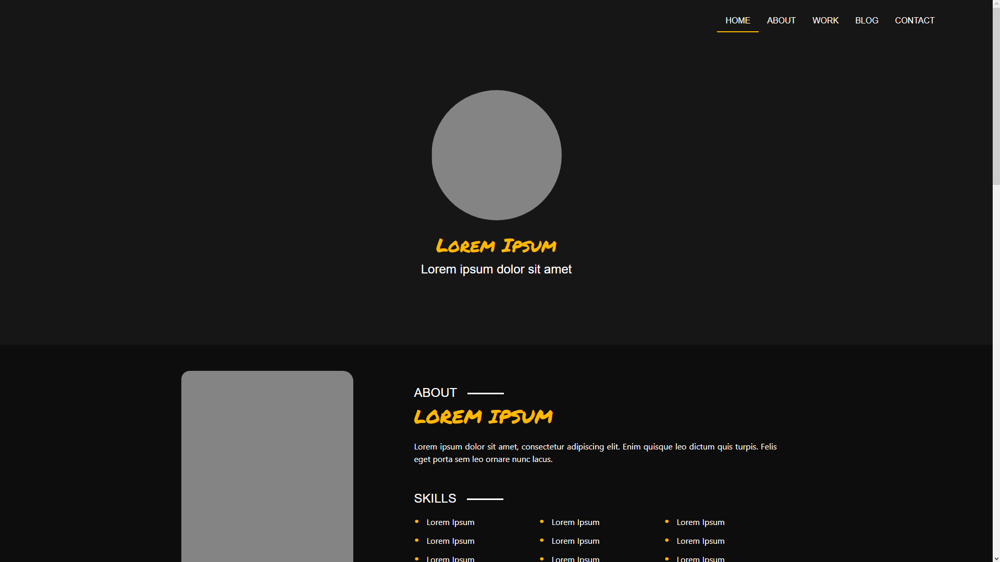

# Layout da Louna Skylander

O Objetivo do Projeto é o Estudo Prático do Framework Bootstrap 5. Para Isso, Foi Usado o Layout da Louna Skylander como Base para o Projeto.

 

Na Imagem Acima É Possível Ver O Layout Da Louna Skylander, O Layout É Simples, Com Nomes Fictícios Em Lorem Ipsum, E Com Imagens De Exemplo. Ha Cards Com Imagens E Textos, Alguns Slides Com Imagens E Textos, E Um Formulário De Contato Fictício.

 
